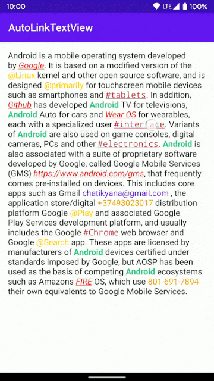

# AutoLinkTextView V2

AutoLinkTextViewV2 is the new version of the AutoLinkTextView.
**The main differences between the old and new version are**
- Fully migration to Kotlin
- Added several new features
- Some imporvements and fixes 

It supports automatic detection and click handlig for Hashtags (#), Mentions (@) , URLs (http://),
Phone Numbers and Emails




The current minSDK version is API level 16 Android TODO

### Download sample [apk][77]
[77]: https://github.com/armcha/AutoLinkTextView/raw/master/screens/AutoLinkTextView.apk

### Features

* Default support for **Hashtag, Mention, Link, Phone number and Email**
* Support for **custom types** via regex
* Transform url to short clickable text
* Ability to apply **multiple spans** to any mode
* Ability to set specific text color
* Ability to set pressed state color


-----------------------

### Download

Gradle:
```groovy
compile 'com.github.armcha:AutoLinkTextView:0.3.0'
```

### Setup and Usage

Add AutoLinkTextView to your layout
```xml
    <com.luseen.autolinklibrary.AutoLinkTextView
         android:id="@+id/active"
         android:layout_width="wrap_content"
         android:layout_height="wrap_content" />
```

```java
AutoLinkTextView autoLinkTextView = (AutoLinkTextView) findViewById(R.id.active);
```

Add one or multiple modes
```java
autoLinkTextView.addAutoLinkMode(
                AutoLinkMode.MODE_PHONE);
```

Add url transformations for tansforming them to short clickable text

Add one or multiple spans to specific mode

Set text to AutoLinkTextView
```java
autoLinkTextView.setAutoLinkText(getString(R.string.long_text));
```

Set AutoLinkTextView click listener
```java
autoLinkTextView.setAutoLinkOnClickListener(new AutoLinkOnClickListener() {
            @Override
            public void onAutoLinkTextClick(AutoLinkMode mode, String matchedText) {

            }
        });
```

Customizing
---------

All possible modes

-------------------------
#### AutoLinkMode.MODE_PHONE


-------------------------
#### AutoLinkMode.MODE_HASHTAG


-------------------------
#### AutoLinkMode.MODE_URL


-------------------------
#### AutoLinkMode.MODE_MENTION


-------------------------
#### AutoLinkMode.MODE_EMAIL


-------------------------
#### AutoLinkMode.MODE_CUSTOM


For use of custom mode add custom regex

```java
autoLinkTextView.setCustomRegex("\\sAndroid\\b");
```
Note:Otherwise ```MODE_CUSTOM``` will return ```MODE_URL```
-------------------------
You can also use multiple modes
```java
autoLinkTextView.addAutoLinkMode(
                AutoLinkMode.MODE_HASHTAG,
                AutoLinkMode.MODE_PHONE,
                AutoLinkMode.MODE_URL,
                AutoLinkMode.MODE_MENTION,
                AutoLinkMode.MODE_CUSTOM);
```

-------------------------
You can transform specific url to short text
```java
autoLinkTextView.addAutoLinkMode(
                AutoLinkMode.MODE_HASHTAG,
                AutoLinkMode.MODE_PHONE,
                AutoLinkMode.MODE_URL,
                AutoLinkMode.MODE_MENTION,
                AutoLinkMode.MODE_CUSTOM);
```

-------------------------
You can change text color for the specific mode
```java
autoLinkTextView.setHashtagModeColor(ContextCompat.getColor(this, R.color.yourColor));
autoLinkTextView.setPhoneModeColor(ContextCompat.getColor(this, R.color.yourColor));
autoLinkTextView.setCustomModeColor(ContextCompat.getColor(this, R.color.yourColor));
autoLinkTextView.setUrlModeColor(ContextCompat.getColor(this, R.color.yourColor));
autoLinkTextView.setMentionModeColor(ContextCompat.getColor(this, R.color.yourColor));
autoLinkTextView.setEmailModeColor(ContextCompat.getColor(this, R.color.yourColor));
```
-------------------------
You can add multiple spans to any mode
```java
autoLinkTextView.addAutoLinkMode(
                AutoLinkMode.MODE_HASHTAG,
                AutoLinkMode.MODE_PHONE,
                AutoLinkMode.MODE_URL,
                AutoLinkMode.MODE_MENTION,
                AutoLinkMode.MODE_CUSTOM);
```

-------------------------
And also autoLink text pressed state color
```java
autoLinkTextView.setSelectedStateColor(ContextCompat.getColor(this, R.color.yourColor));
```
-------------------------

### Contact :book:

:arrow_forward:  **Email**: chatikyana@gmail.com

:arrow_forward:  **Medium**: https://medium.com/@chatikyan

:arrow_forward:  **Twitter**: https://twitter.com/ArmanChatikyan

:arrow_forward:  **Google+**: https://plus.google.com/+ArmanChatikyan

:arrow_forward:  **Website**: https://armcha.github.io/


License
--------


      Auto Link TextView V2 library for Android
      Copyright (c) 2019 Arman Chatikyan (https://github.com/armcha/AutoLinkTextViewV2).

      Licensed under the Apache License, Version 2.0 (the "License");
      you may not use this file except in compliance with the License.
      You may obtain a copy of the License at

         http://www.apache.org/licenses/LICENSE-2.0

      Unless required by applicable law or agreed to in writing, software
      distributed under the License is distributed on an "AS IS" BASIS,
      WITHOUT WARRANTIES OR CONDITIONS OF ANY KIND, either express or implied.
      See the License for the specific language governing permissions and
      limitations under the License.
